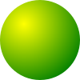

# Why hu.js

The general awkwardness of DOM functions is even worse for SVG than for HTML.

You don't want to create an element with:

    const rect = document.createElementNS("http://www.w3.org/2000/svg", "rect");

You'd rather have concise, chainable and convenient functions not too inspired by Java, and to have internal references to gradients managed for you. Of course you want the few traps and browser differences handled for you.

And that might be about all you need. Because SVG is already a very high level model, you don't usually need a higher model to draw shapes in your browser. You don't need functions hiding the logic of the SVG.

And you don't want to import a big JavaScript file for that. [hu.min.js](hu.min.js) weights 1.4 kb when gziped and has no dependency.

That's why you might find hu.js useful, assuming its limited set of features isn't too limited for you.

# Basic Example

    // Add to the body a new SVG element
    const svg = hu('<svg>', 'body').css({ width:100, height:100 });

    // Define a reusable radial gradient
    const grad = svg.rgrad(0.3, 0.3, 0.8, 'yellow', 'green');

    // Draw a circle using this gradient
    hu('<circle>', svg).attr({ cx:50, cy:50, r:50, fill:grad });

### Result :

### SVG :

    <svg style="width: 100px; height: 100px;">
    	<defs>
    		<radialGradient id="ù1" cx="0.3" cy="0.3" r="0.8">
    			<stop offset="0%" stop-color="yellow"></stop>
    			<stop offset="100%" stop-color="green"></stop>
    		</radialGradient>
    	</defs>
    	<circle cx="50" cy="50" r="50" fill="url(#ù1)"></circle>
    </svg>

# More complex examples

This still simple example has more shapes, event handling and animations :

**[Demonstration](http://dystroy.org/demos/hu.js/demo.html)**

See the commented source of the page to see how it's done.

hu.js is used for everything svg related in the open source [Miaou](http://dystroy.org/miaou/static/intro.html) platform, including a game.

# API

## hu

The entry point of the library is the `hu` function. It's also aliased as `ù` which is obviously shorter and prettier but there's no problem in using `hu` if you're in a poor country where keyboards suffer from a deficiency in `ù` keys.

This function is used to

- create an svg element (and optionally append it to an existing html or svg element)
- find an existing svg element with a css selector
- wrap a provided svg element (and optionally append it to an existing html or svg element)

In all cases, there's always exactly one svg element in a resulting `Hu` object. The `hu` function returns `null` if the passed arguments make it impossible to create the element. If a provided selector (or nodelist, or jquery set, or array of elements) refers to more than one element, only the first one is considered.

#### Examples

Create an `svg` element and add it to `document.body`:

    const svg = hu('<svg>', document.body);

Just create an element that we'll append later:

    const group = hu('<g>');

Get an element we have in our group:

    const rect = hu('#rectId', group);

## attr / css

These very similar functions let you set attributes or style properties.

#### Examples

Get the value of an attribute

    const cx = circle.attr('cx');

Set a style property

    svg.css('background', '#2a4646');

Create a `line`, append it to a group and set a few attributes

    hu('<line>', group).attr({
    	x1:10, y1:20, x2:30, y2:40,
    	stroke:'green', strokeOpacity:0.6,
    	strokeWidth:5, strokeLinecap:'round'
    });

## def

`def` creates an SVG node, adds it to the `defs` element of the closest element of type `svg`, and gives it an automatically generated id.

This is useful for shared resources like gradients.

#### Examples

Create a diagonal linear gradient with four steps of decreasing opacity, use it in a rectangle

    const grad = svg.def('<linearGradient>').attr({
    	x1:0, y1:0, x2:1, y2:1
    }).stops(
    	{offset:"0%", stopColor:"red", stopOpacity:1},
    	{offset:"7%", stopColor:"green", stopOpacity:0.9},
    	{offset:"20%", stopColor:"red", stopOpacity:0.2},
    	{offset:"100%", stopColor:"green", stopOpacity:0}
    );
    ù('<rect>', svg).attr({x:0, y:0, width:100, height:20, fill:grad});

#### Using your own manual id instead of the automatically generated one

    const logo = svg.def('<g>').attr('id','logo');

## rgrad

`rgrad` is a shortcut to create a simple radial gradient.

#### Example

    const grad = svg.rgrad(0.3, 0.3, 0.8, 'white', 'rgba(100,50,57,0.2)');

_Note : similar hgrad and vgrad functions might be available in the future as shortcuts for horizontal and vertical gradients. Just ask if you want them now._

## animate

Animates one or more numerical style properties or attributes.

#### Example

    ù('<line>', svg).attr({
    	x1:100, y1:0, x2:200, y2:20,
    	stroke:'red', strokeOpacity:0.8,
    }).animate({strokeOpacity:0, x2:300}, 1000, function(){
    	this.remove();
    });

This example can also be simplified into

    ù('<line>', svg).attr({
    	x1:100, y1:0, x2:200, y2:20,
    	stroke:'red', strokeOpacity:0.8,
    }).animate({strokeOpacity:0, x2:300}, 1000, ù.remove);

## on / off

Those functions bind or unbind an event handler. You can pass several event types by separating them with spaces.

#### Example

    hu('<rect>', svg)
    .attr({x:0, y:100, width:200, height:300})
    .css({cursor:'pointer'})
    .on('click', function(){
    	hu(this).animate({x:100}, 500);
    });

## append / prependTo

These functions let you append or prepend elements. The argument can be an svg node, a hu element, a css selector, an HTMLCollection, a jQuery element, etc.

## remove

Removes the element on which it is called.

## empty

Removes the svg nodes. (not the defs: to remove everything, just call the standard DOM functions)

## text

Sets the innerText of the svg element.

#### Example

    ù('<text>', g)
    .attr({x:50, y:50, textAnchor:"middle", alignmentBaseline:"middle"})
    .css({fontWeight:'bold', fill:'white'})
    .text('I am a centered white text');

# Extension

You can easily add functions to hu elements.

## Example

    ù.fn.textpos = function(x, y){
    	this.attr({x:x, y:y, textAnchor:"middle", alignmentBaseline:"middle"});
    }
    ù('<text>', svg).text("my centered label").textpos(50, 50);

# License

The [MIT License](http://opensource.org/licenses/MIT).
